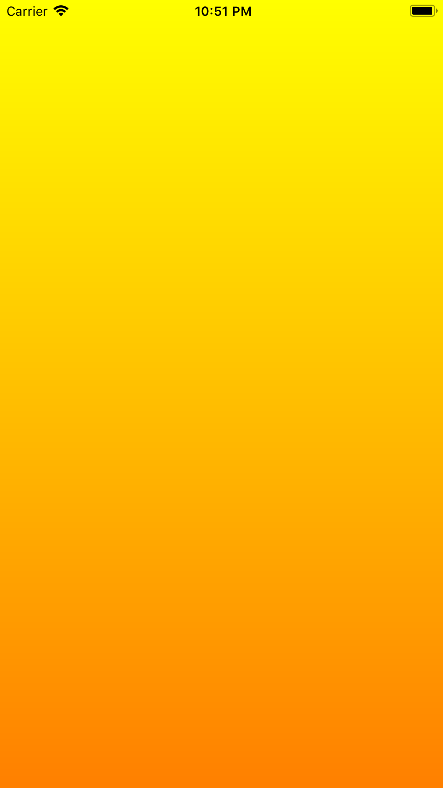

# 1.1 实现两种颜色的渐变背景

### （1） **下面代码将我们主视图 View 的背景设置成从黄色过渡到橙色的渐变色（方向为默认的自上而下）**

```swift
import UIKit

class ViewController: UIViewController {

    override func viewDidLoad() {
        super.viewDidLoad()
        // Do any additional setup after loading the view.
        demo1()
    }
}

extension ViewController {
    
    /// 黄色 -> 橙色渐变色
    func demo1() {
        //定义渐变的颜色（从黄色渐变到橙色）
        let topColor = UIColor.yellow
        let buttomColor = UIColor.orange
        let gradientColors = [topColor.cgColor, buttomColor.cgColor]
        
        //定义每种颜色所在的位置
        let gradientLocations:[NSNumber] = [0.0, 1.0]
        
        //创建CAGradientLayer对象并设置参数
        let gradientLayer = CAGradientLayer()
        gradientLayer.colors = gradientColors
        gradientLayer.locations = gradientLocations
        
        //设置其CAGradientLayer对象的frame，并插入view的layer
        gradientLayer.frame = self.view.frame
        self.view.layer.insertSublayer(gradientLayer, at: 0)
    }
}
```

### **（2）效果图**




