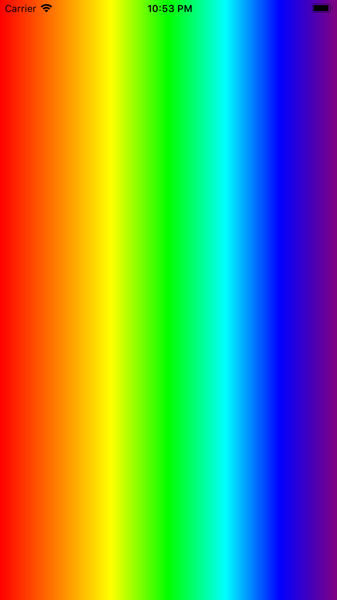

# 1.2 实现多种颜色的渐变背景（彩虹）

### （1）下面代码再多添加几种颜色，实现类似彩虹的渐变效果，同时渲染方向改为从左到右。

```swift
import UIKit

class ViewController: UIViewController {

    override func viewDidLoad() {
        super.viewDidLoad()
        // Do any additional setup after loading the view.
        demo2()
    }
}

extension ViewController {
    
    /// 彩虹渐变色
    func demo2() {
        // 1.定义渐变的颜色（赤橙黄绿青蓝紫）
        let gradientColors = [UIColor.red.cgColor,
                              UIColor.orange.cgColor,
                              UIColor.yellow.cgColor,
                              UIColor.green.cgColor,
                              UIColor.cyan.cgColor,
                              UIColor.blue.cgColor,
                              UIColor.purple.cgColor]
        
        // 2.定义每种颜色所在的位置
        let gradientLocations:[NSNumber] = [0.0, 0.17, 0.33, 0.5, 0.67, 0.83, 1.0]
        
        // 3.创建CAGradientLayer对象并设置参数
        let gradientLayer = CAGradientLayer()
        gradientLayer.colors = gradientColors
        gradientLayer.locations = gradientLocations
        
        // 4.设置渲染的起始位置和终止位置
        gradientLayer.startPoint = CGPoint(x: 0, y: 0)
        gradientLayer.endPoint = CGPoint(x: 1, y: 0)
        
        // 5.设置其CAGradientLayer对象的frame，并插入view的layer
        gradientLayer.frame = self.view.frame
        self.view.layer.insertSublayer(gradientLayer, at: 0)
    }
}
```

### （2）效果图



