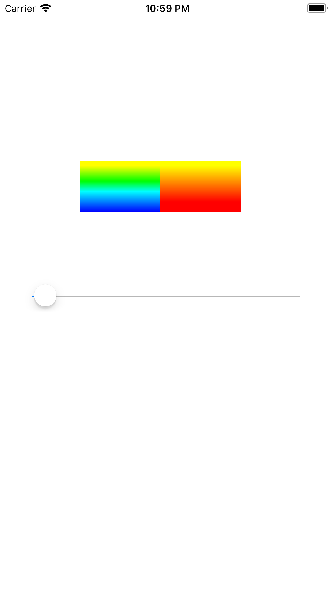

# 2、实现原理

（1）整个进度条组件分成进度条后面的`轨道`，以及覆盖在上方的具有渐变色的`进度条`。这里主要讲讲后者的实现。

（2）首先使用 `CAShapeLayer` 配合 `UIBezierPath` 绘制一个圆弧，这个便是进度条。进度条长短百分比我们可以通过 `CAShapeLayer` 的 **`strokeEnd`** 属性来实现。

（3）接着我们使用 `CAGradientLayer` 绘制一个渐变层。由于 `CAGradientLayer` 不能顺着弧线进行渐变，只能指定两个点之间进行渐变。所以我们先分别绘制左右两部分的渐变：

* **左半部分：**颜色从上往下是黄色渐变到蓝色
* **右半部分：**颜色从上往下是黄色渐变到红色

（4）最后将渐变层的遮罩设置成前面由 `CAShapeLayer` 创建的进度弧线，这样一个带有渐变色的进度圆弧就完成了。

