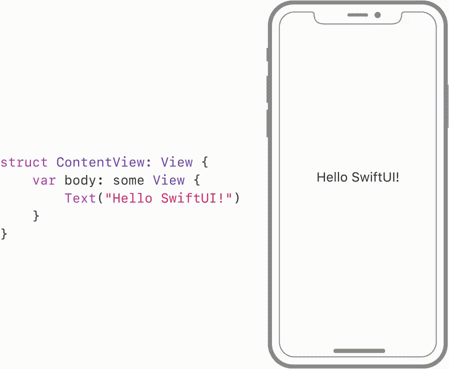
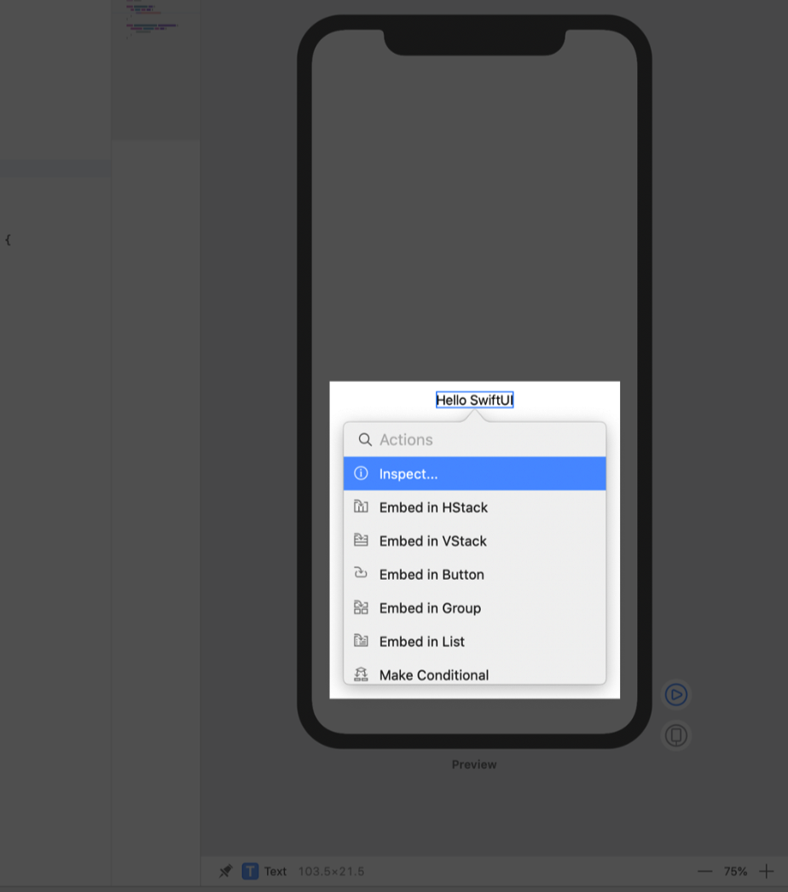
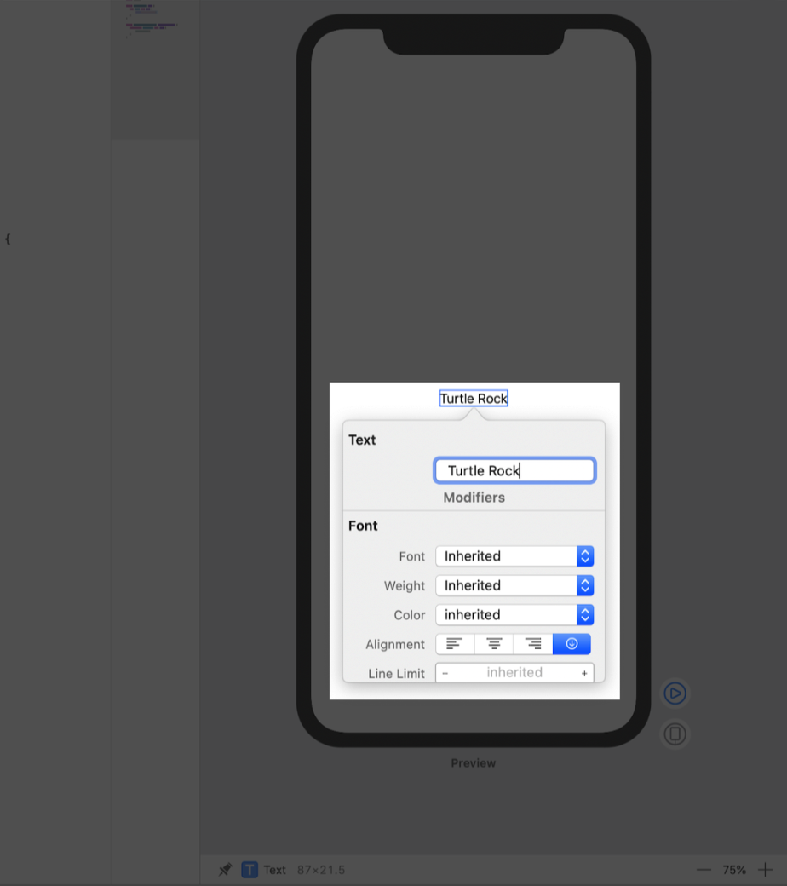
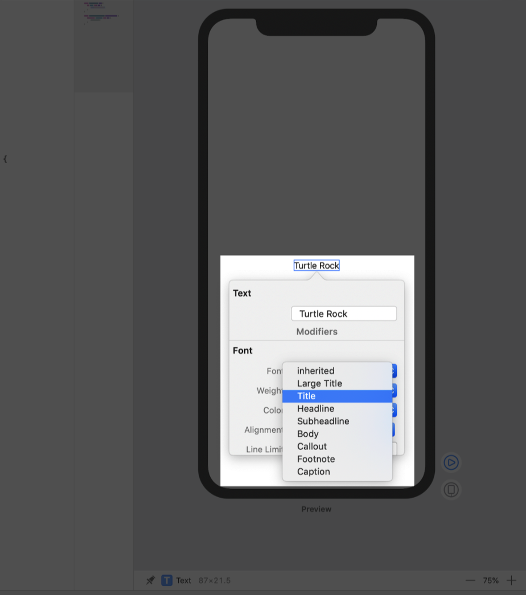
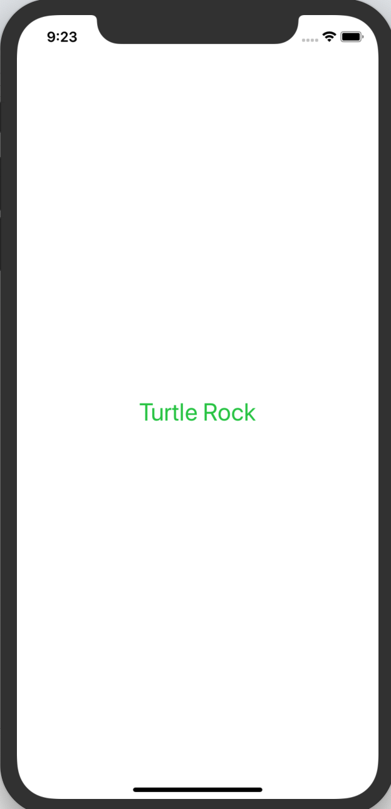
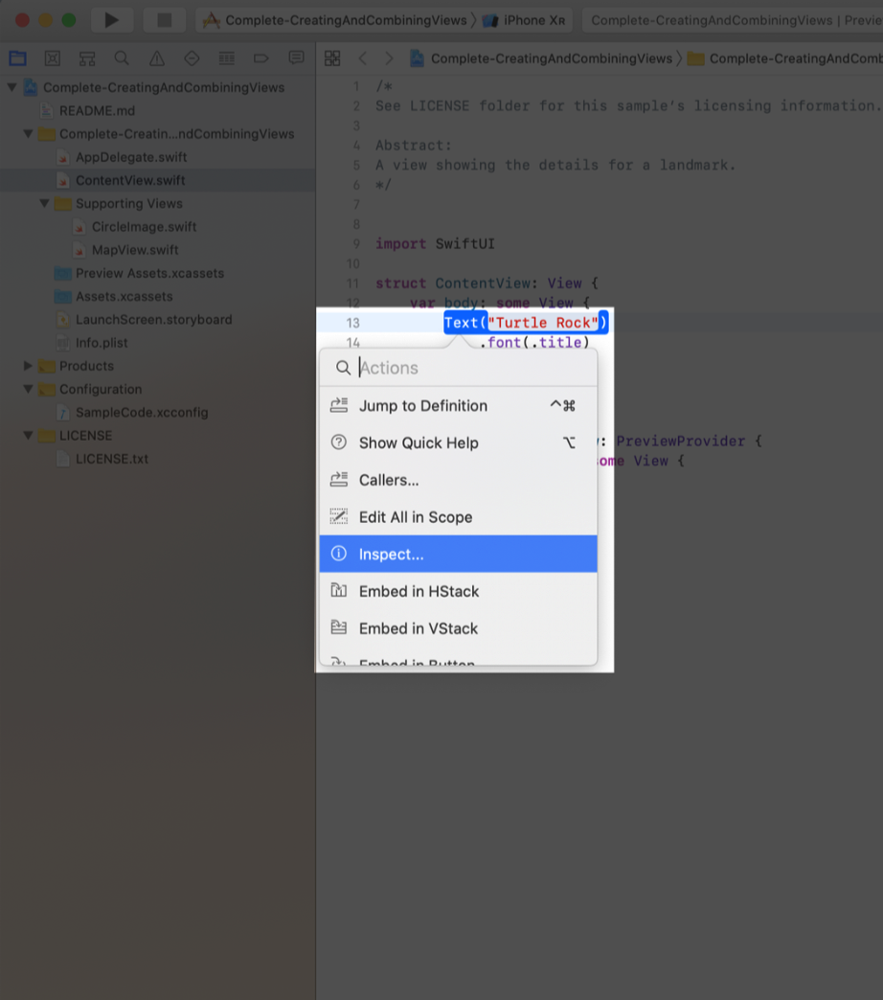
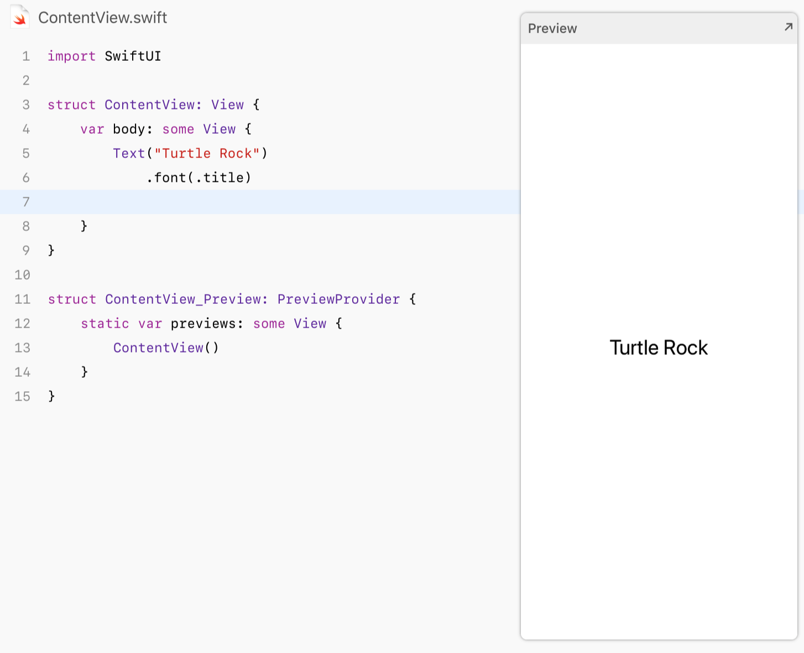

# 1.2 自定义 textView

为了自定义 view 的显示，我们可以自己更改代码，或者使用 `inspector` 来帮助我们编写代码。

在构建 `Landmarks` 的过程中，我们可以使用任何编辑器来工作：编写源码、修改 `canvas`、或者通过 `inspectors` ，无论使用哪种工具，代码都会保持更新。



接下来，我们使用 `inspector` 来自定义 `text view` 。

#### 第 1 步:

在预览中，按住 `Command` 并单击问候语来显示编辑窗口，然后选择 `Inspect` 。编辑窗口显示了可以修改的不同属性，具体取决于其 view 类型。



#### 第 2 步:

用 `inspector` 将文本改为 `Turtle Rock` ，这是在 app 中显示的第一个地标的名字。



#### 第 3 步:

将 `Font` 修改为 `Title` 。  
这个修改会让文本使用系统字体，之后它就能正确显示用户的偏好字体大小和设置。



#### 第 4 步:

在代码中添加 `.color(.green)` ，将文本的颜色更改为绿色。

如果想自定义 `SwiftUI` 的 view，我们可以调用一类叫做 `modifiers` 的方法。这类方法通过包装一个 view 来改变它的显示或者其他属性。每个 `modifiers` 方法会返回一个新的 view，因此我们可以链式调用多个 `modifiers` 方法。

> ContentView.swift

```swift
import SwiftUI

struct ContentView: View {
    var body: some View {
        Text("Turtle Rock")
            .font(.title)
            .color(.green)
    }
}

struct ContentView_Preview: PreviewProvider {
    static var previews: some View {
        ContentView()
    }
}
```



view 的真实来源其实是代码，当我们使用 `inspector` 修改或删除 `modifiers` 时，Xcode 会立即更新我们的代码。

#### 第 5 步：

这次我们在代码编辑区按住 `Command` ，单击 `Text` 的声明来打开 `inspector` ，然后选择 `Inspect` 。单击颜色菜单并且选择 `Inherited` ，这样文字又变回了黑色。



#### 第 6 步:

注意，Xcode 会自动针对修改来更新代码，例如删除了 `.color(.green)` 。

> ContentView.swift

```text
import SwiftUI

struct ContentView: View {
    var body: some View {
        Text("Turtle Rock")
            .font(.title)

    }
}

struct ContentView_Preview: PreviewProvider {
    static var previews: some View {
        ContentView()
    }
}
```




