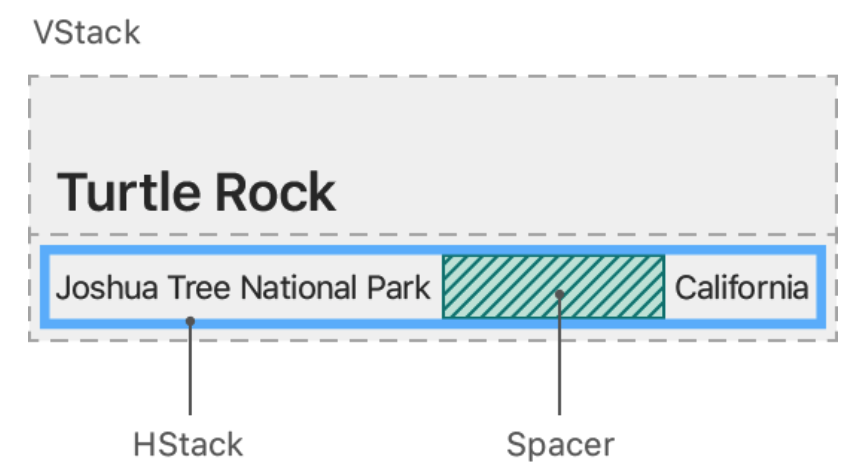
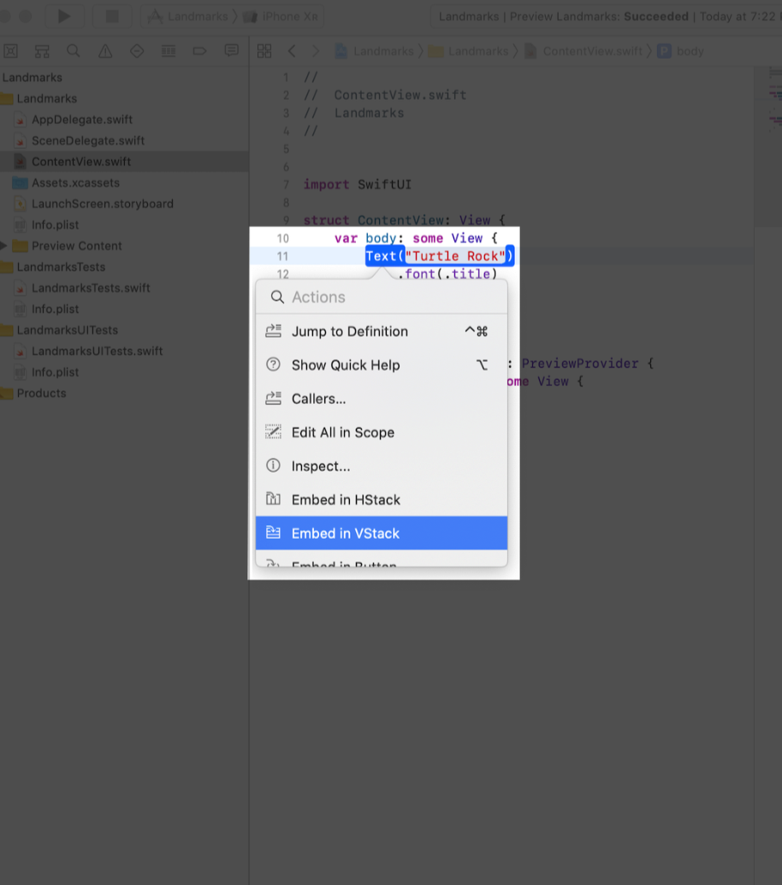
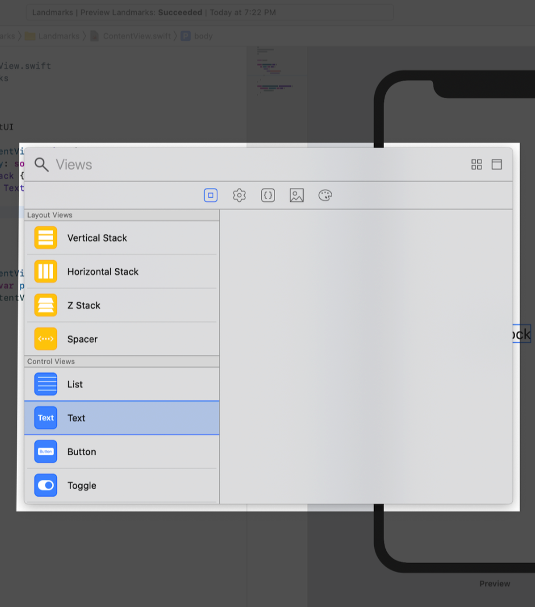

# 1.3 - 用  stacks 组合 View

在上一节创建标题 view 后，我们来添加 text view，它用来显示地标的详细信息，比如公园的名称和所在的州。

在创建 `SwiftUI` view 时，我们可以在 view 的 `body` 属性中描述其内容、布局和行为。由于 `body`属性仅返回单个 view，所以我们可以使用 `Stacks` 来组合和嵌入多个 view，让它们以水平、垂直或从后到前的顺序组合在一起。

在本节中，我们使用水平的 `stack` 来显示公园的详细信息，再用垂直的 `stack` 将标题放在详细信息的上面。



我们可以使用 Xcode 的编辑功能将 view 嵌入到一个容器里，也可以使用 `inspector` 或者 `help` 找到更多帮助。

#### 第 1 步：

按住 `Command` 并单击 text view 的初始化方法，在编辑窗口中选择 `Embed in VStack` 。



接下来，我们从 `Library` 中拖一个 `Text view` 添加到 `stack` 中。

#### 第 2 步:

单击 Xco​​de 右上角的加号按钮 `(+)` 打开 `Library` ，然后拖一个 `Text view` ，放在代码中 `Turtle Rock` 的后面。



#### 第 3 步:

将 `Placeholder` 改成 `Joshua Tree National Park` 。

> ContentView.swift

```swift
import SwiftUI

struct ContentView: View {
    var body: some View {
        VStack {
            Text("Turtle Rock")
                .font(.title)
            Text("Joshua Tree National Park")
        }
    }
}

#if DEBUG
struct ContentView_Preview: PreviewProvider {
    static var previews: some View {
        ContentView()
    }
}
#endif
```


调整地点 view 以满足布局需求。

#### 第 4 步:

将地点 view 的 `font` 设置成 `.subheadline` 。

> ContentView.swift

```swift
import SwiftUI

struct ContentView: View {
    var body: some View {
        VStack {
            Text("Turtle Rock")
                .font(.title)
            Text("Joshua Tree National Park")
                .font(.subheadline)
        }
    }
}

#if DEBUG
struct ContentView_Preview: PreviewProvider {
    static var previews: some View {
        ContentView()
    }
}
#endif
```


#### 第 5 步：

编辑 `VStack` 的初始化方法，将 view 以 `leading` 方式对齐。  
默认情况下， `stacks` 会将内容沿其轴居中，并设置适合上下文的间距。

> ContentView.swift

```swift
import SwiftUI

struct ContentView: View {
    var body: some View {
        VStack(alignment: .leading) {
            Text("Turtle Rock")
                .font(.title)
            Text("Joshua Tree National Park")
                .font(.subheadline)
        }
    }
}

#if DEBUG
struct ContentView_Preview: PreviewProvider {
    static var previews: some View {
        ContentView()
    }
}
#endif
```


接下来，我们在地点的右侧添加另一个 text view 来显示公园所在的州。

#### 第 6 步:

`canvas` 中按住 `Command` ，单击 `Joshua Tree National Park` ，然后选择 `Embed in HStack` 。


#### 第 7 步：

在地点后新加一个 text view，将 `Placeholder` 修改成 `California` ，然后将 `font` 设置成 `.subheadline` 。

```swift
import SwiftUI

struct ContentView: View {
    var body: some View {
        VStack(alignment: .leading) {
            Text("Turtle Rock")
                .font(.title)
            HStack {
                Text("Joshua Tree National Park")
                    .font(.subheadline)
                Text("California")
                    .font(.subheadline)
            }
        }
    }
}

#if DEBUG
struct ContentView_Preview: PreviewProvider {
    static var previews: some View {
        ContentView()
    }
}
#endif
```


#### 第 8 步:

在水平 `stack` 中添加一个 `Spacer` 来分割及固定 `Joshua Tree National Park` 和 `California` ，这样它们就会共享整个屏幕宽度。  
`spacer` 能展开它包含的 view ，使它们共用其父 view 的所有空间，而不是仅通过其内容定义其大小。

> ContentView.swift

```swift
import SwiftUI

struct ContentView: View {
    var body: some View {
        VStack(alignment: .leading) {
            Text("Turtle Rock")
                .font(.title)
            HStack {
                Text("Joshua Tree National Park")
                    .font(.subheadline)
                Spacer()
                Text("California")
                    .font(.subheadline)
            }
        }
    }
}

#if DEBUG
struct ContentView_Preview: PreviewProvider {
    static var previews: some View {
        ContentView()
    }
}
#endif
```


#### 第 9 步：

最后，用 `.padding()` 这个修饰方法给地标的名称和信息留出一些空间。

> ContentView.swift

```swift
import SwiftUI

struct ContentView: View {
    var body: some View {
        VStack(alignment: .leading) {
            Text("Turtle Rock")
                .font(.title)
            HStack {
                Text("Joshua Tree National Park")
                    .font(.subheadline)
                Spacer()
                Text("California")
                    .font(.subheadline)
            }
        }
        .padding()
    }
}

#if DEBUG
struct ContentView_Preview: PreviewProvider {
    static var previews: some View {
        ContentView()
    }
}
#endif
```


