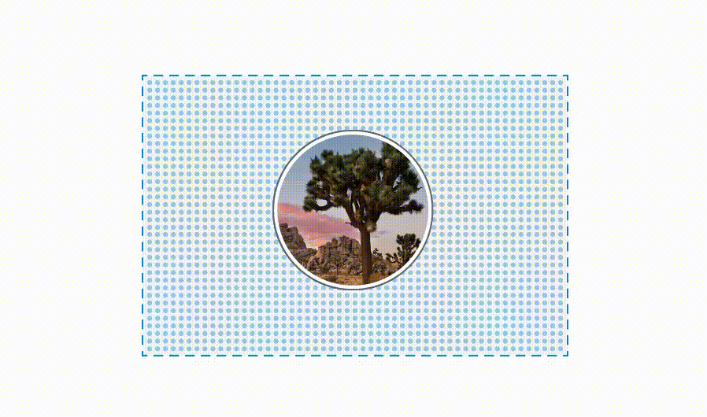
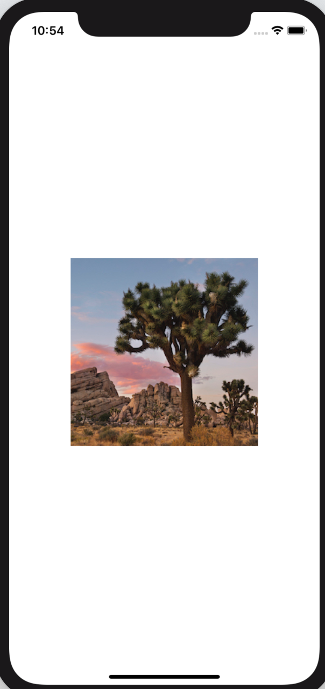

# 1.4 自定义 image View

搞定名称和位置 view 后，我们来给地标添加图片。  
这不需要添加很多代码，只需要创建一个自定义 view，然后给图片加上遮罩、边框和阴影即可。



首先将图片添加到项目的 `asset catalog` 中。

#### 第 1 步：

在项目的 `Resources` 文件夹中找到 `turtlerock.png` ，将它拖到 `asset catalog` 的编辑器中。 Xcode 会给图片创建一个 `image set` 。  


接下来，创建一个新的 `SwiftUI` view 来自定义 image view。

#### 第 2 步:

选择 `File` &gt; `New` &gt; `File` 打开模板选择器。在 `User Interface` 中，选中 `SwiftUI View` ，然后单击 `Next` 。将文件命名为 `CircleImage.swift` ，然后单击 `Create` 。


现在准备工作已完成。

#### 第 3 步:

使用 `Image(_:)` 初始化方法将 text view 替换为 `Turtle Rock` 的图片。

> CircleImage.swift

```swift
import SwiftUI

struct CircleImage : View {
    var body: some View {
        Image("turtlerock")
    }
}

#if DEBUG
struct CircleImage_Previews : PreviewProvider {
    static var previews: some View {
        CircleImage()
    }
}
#endif
```



#### 第 4 步:

调用 `.clipShape(Circle())` ，将图像裁剪成圆形。

> CircleImage.swift

```swift
import SwiftUI

struct CircleImage : View {
    var body: some View {
        Image("turtlerock")
            .clipShape(Circle())
    }
}

#if DEBUG
struct CircleImage_Previews : PreviewProvider {
    static var previews: some View {
        CircleImage()
    }
}
#endif
```


#### 第 5 步:

创建另一个 `gray stroke` 的 `circle` ，然后将其作为 `overlay` 添加到图片上，形成图片的边框。

> CircleImage.swift

```swift
import SwiftUI

struct CircleImage : View {
    var body: some View {
        Image("turtlerock")
            .clipShape(Circle())
            .overlay(Circle().stroke(Color.gray, lineWidth: 4))
    }
}

#if DEBUG
struct CircleImage_Previews : PreviewProvider {
    static var previews: some View {
        CircleImage()
    }
}
#endif
```


#### 第 6 步:

接来下，添加一个半径为 10 point 的阴影。

> CircleImage.swift

```swift
import SwiftUI

struct CircleImage : View {
    var body: some View {
        Image("turtlerock")
            .clipShape(Circle())
            .overlay(Circle().stroke(Color.gray, lineWidth: 4))
            .shadow(radius: 10)
    }
}

#if DEBUG
struct CircleImage_Previews : PreviewProvider {
    static var previews: some View {
        CircleImage()
    }
}
#endif
```


#### 第 7 步:

将边框的颜色改为 `white` ，完成 image view。

> CircleImage.swift

```text
import SwiftUI

struct CircleImage : View {
    var body: some View {
        Image("turtlerock")
            .clipShape(Circle())
            .overlay(Circle().stroke(Color.white, lineWidth: 4))
            .shadow(radius: 10)
    }
}

#if DEBUG
struct CircleImage_Previews : PreviewProvider {
    static var previews: some View {
        CircleImage()
    }
}
#endif
```


