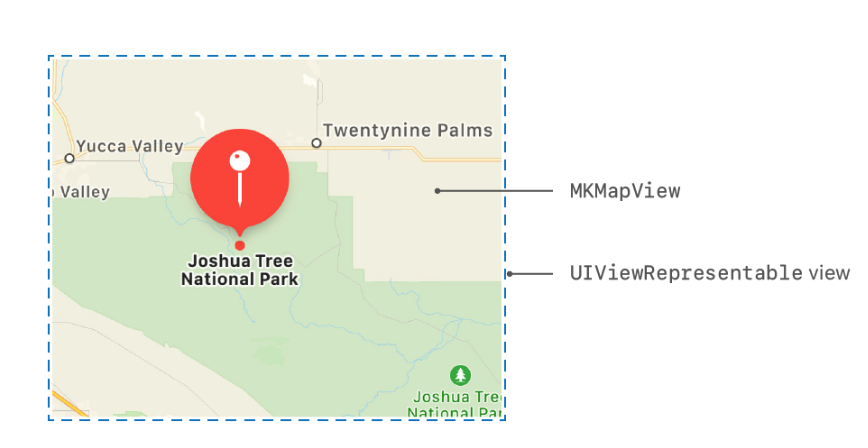
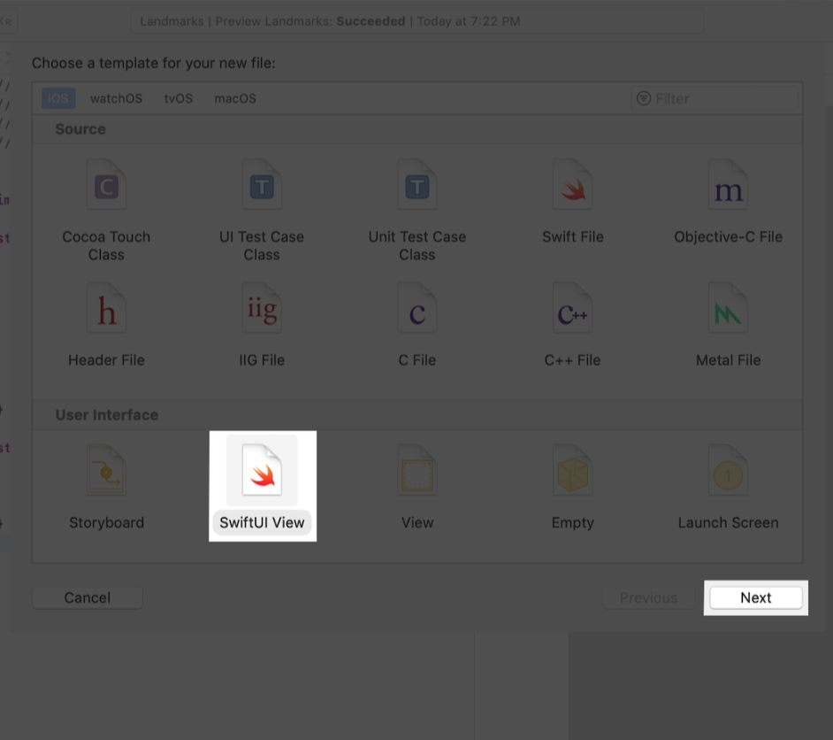
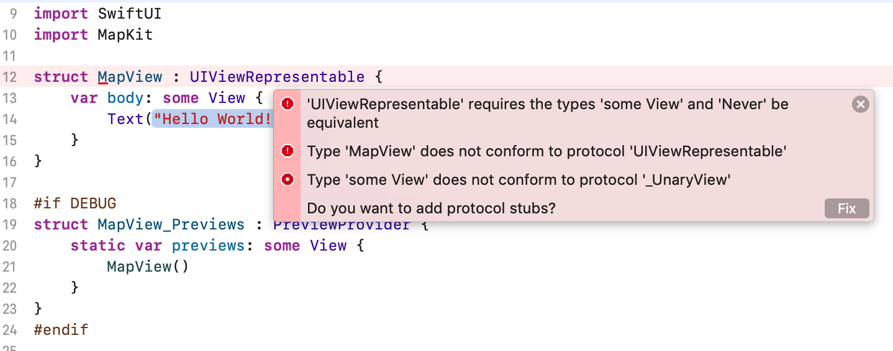
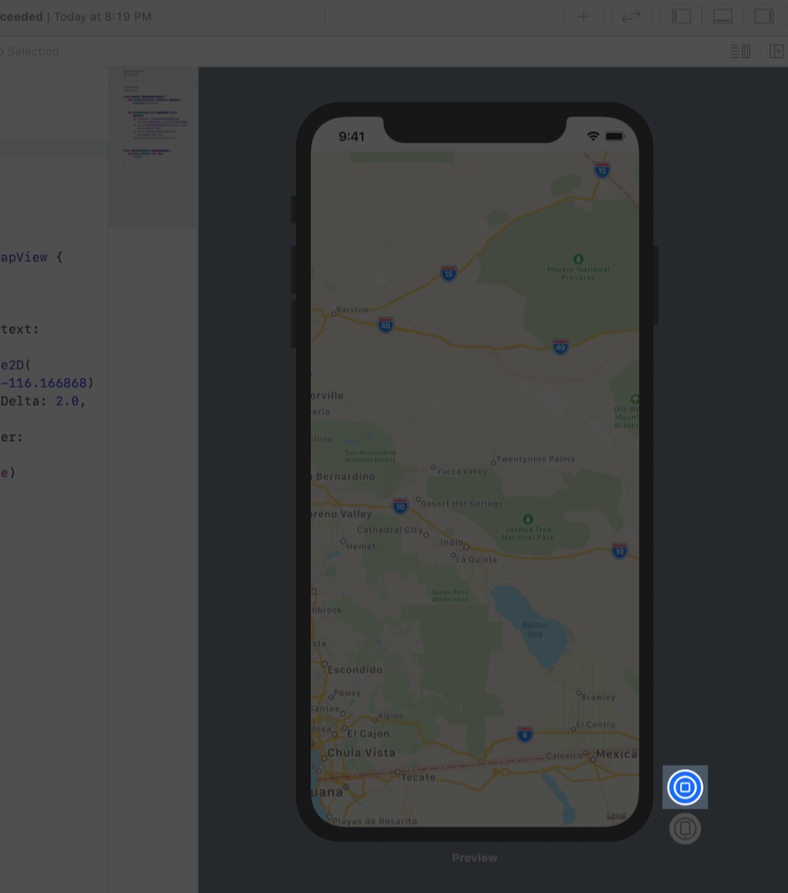

# 1.5 - 同时使用 UIKit 和 SwiftUI

至此，我们已准备好创建 map view 了，接下来使用 `MapKit` 中的 `MKMapView` 类来渲染地图。



为了在 `SwiftUI` 中使用 `UIView` 的子类，需要将其它 **view** 包装在遵循 `UIViewRepresentable` 协议的 `SwiftUI view` 中。`SwiftUI` 包含了和 `WatchKit`，`AppKit` view 类似的协议。  
首先，我们创建一个可以呈现 `MKMapView` 的自定义 view。

#### 第 1 步:

选择 `File` &gt; `New` &gt; `File` ，选择 `iOS` 平台，选择 `SwiftUI View` 模板，然后单击 `Next` 。将新文件命名为 `MapView.swift` ，然后单击 `Create` 。



#### 第 2 步:

在 `MapView.swift` 中 `import MapKit`，并声明 `MapView` 类型遵循 `UIViewRepresentable` 。

> MapView.swift

```swift
import SwiftUI
import MapKit

struct MapView : UIViewRepresentable {
    var body: some View {
        Text(/*@START_MENU_TOKEN@*/"Hello World!"/*@END_MENU_TOKEN@*/)
    }
}

#if DEBUG
struct MapView_Previews : PreviewProvider {
    static var previews: some View {
        MapView()
    }
}
#endif
```

这个时候，代码报错，可以忽略 Xcode 的错误，接下来的几步会解决这些问题。



`UIViewRepresentable` 协议需要实现两个方法：   
👉 `makeUIView(context:)` 用来创建一个 `MKMapView`，   
👉 `updateUIView(_:context:)` 用来配置 view 并响应修改。

#### 第 3 步: 

用 `makeUIView(context:)` 方法替换 `body` 属性，该方法创建并返回一个空的 `MKMapView`。

> MapView.swift

```swift
import SwiftUI
import MapKit

struct MapView : UIViewRepresentable {
    
    typealias UIViewType = MKMapView
    
    func makeUIView(context: UIViewRepresentableContext<MapView>) -> MKMapView {
        return MKMapView(frame: .zero)
    }
}

#if DEBUG
struct MapView_Previews : PreviewProvider {
    static var previews: some View {
        MapView()
    }
}
#endif
```

#### 第 4 步:

实现 `updateUIView(_:context:)` 方法，给 map view 设置坐标，使其在 `Turtle Rock` 上居中。

> MapView.swift

```swift
import SwiftUI
import MapKit

struct MapView : UIViewRepresentable {
    
    typealias UIViewType = MKMapView
    
    func makeUIView(context: UIViewRepresentableContext<MapView>) -> MKMapView {
        return MKMapView(frame: .zero)
    }
    
    func updateUIView(_ uiView: MKMapView, context: UIViewRepresentableContext<MapView>) {
        let coordinate = CLLocationCoordinate2D(
            latitude: 34.011286, longitude: -116.166868)
        let span = MKCoordinateSpan(latitudeDelta: 2.0, longitudeDelta: 2.0)
        let region = MKCoordinateRegion(center: coordinate, span: span)
        uiView.setRegion(region, animated: true)
    }
}

#if DEBUG
struct MapView_Previews : PreviewProvider {
    static var previews: some View {
        MapView()
    }
}
#endif
```

当预览处于 `static mode` 时仅显示 `SwiftUI` view 。因为 `MKMapView` 是一个 `UIView` 的子类，所以需要切换到实时模式才能看到地图。

#### 第 5 步:

单击 `Live Preview` 可将预览切换为实时模式，有时也会用到 `Try Again` 或 `Resume` 按钮。  
片刻之后，你会看到 `Joshua Tree National Park` 的地图，这是 `Turtle Rock` 的故乡。




