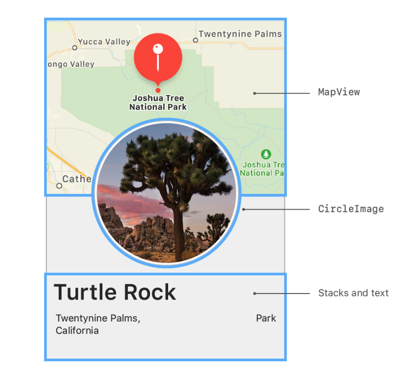
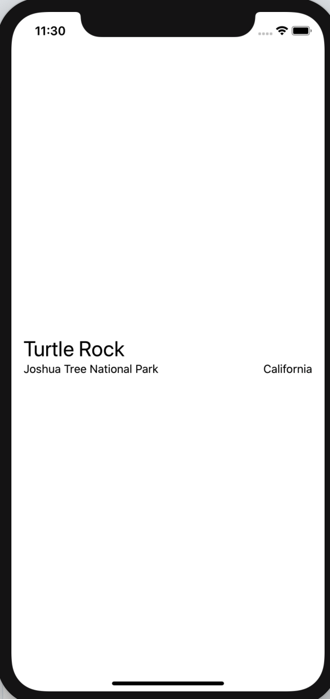
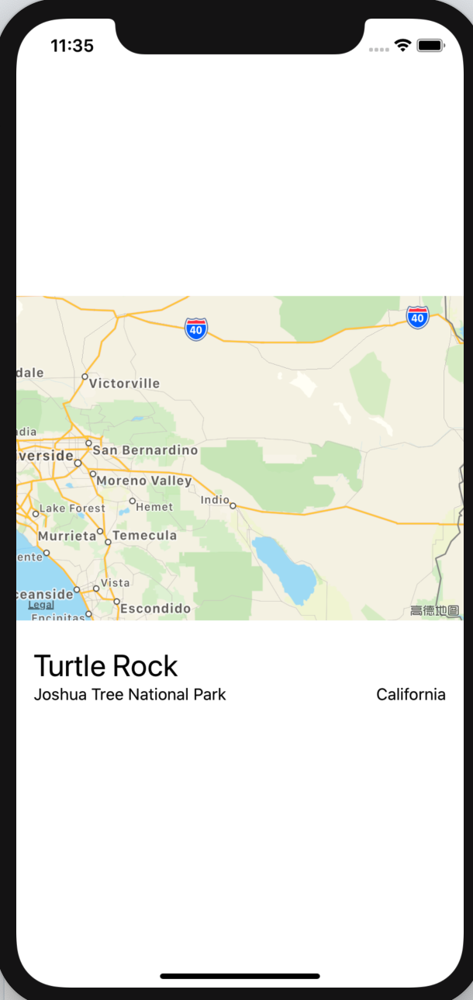

# 1.6 - 编写详情 View

现在我们完成了所需的所有组件：名称、地点、圆形图片和地图。  
继续使用目前的工具，将这些组件组合起来变成符合最终设计的详情 view。



#### 第 1 步:

在项目导航中，选中 `ContentView.swift` 文件。

> ContentView.swift

```swift
import SwiftUI

struct ContentView : View {
    var body: some View {
        VStack(alignment: .leading) {
            Text("Turtle Rock")
                .font(.title)
            HStack {
                Text("Joshua Tree National Park")
                    .font(.subheadline)
                Spacer()
                Text("California")
                    .font(.subheadline)
            }
        }
        .padding()
    }
}

#if DEBUG
struct ContentView_Previews : PreviewProvider {
    static var previews: some View {
        ContentView()
    }
}
#endif
```

#### 第 2 步:

把之前的的 `VStack` 嵌入到另一个新 的 `VStack` 中。

> ContentView.swift

```swift
import SwiftUI

struct ContentView : View {
    var body: some View {
        VStack {
            VStack(alignment: .leading) {
                Text("Turtle Rock")
                    .font(.title)
                HStack {
                    Text("Joshua Tree National Park")
                        .font(.subheadline)
                    Spacer()
                    Text("California")
                        .font(.subheadline)
                }
                }
                .padding()
        }
    }
}

#if DEBUG
struct ContentView_Previews : PreviewProvider {
    static var previews: some View {
        ContentView()
    }
}
#endif
```



#### 第 3 步:

将自定义的 `MapView` 添加到 `stack` 顶部，使用 `frame(width:height:)` 方法来设置 `MapView`的大小。  
如果仅指定了 `height` 参数，view 会自动调整其内容的宽度。此节中， `MapView` 会展开并填充所有可用空间。

> ContentView.swift

```swift
import SwiftUI

struct ContentView : View {
    var body: some View {
        VStack {
            MapView()
                .frame(height: 300)
            VStack(alignment: .leading) {
                Text("Turtle Rock")
                    .font(.title)
                HStack(alignment: .top) {
                    Text("Joshua Tree National Park")
                        .font(.subheadline)
                    Spacer()
                    Text("California")
                        .font(.subheadline)
                }
            }
            .padding()
        }
    }
}

#if DEBUG
struct ContentView_Previews : PreviewProvider {
    static var previews: some View {
        ContentView()
    }
}
#endif
```



#### 第 4 步:

单击 `Live Preview` 按钮，在组合 view 中查看渲染的地图。  
在此过程中，我们可以继续编辑 view。

#### 第 5 步:

将 `CircleImage` 添加到 `stack` 中。

> ContentView.swift

```swift
import SwiftUI

struct ContentView : View {
    var body: some View {
        VStack {
            MapView()
                .frame(height: 300)
            
            CircleImage()
            
            VStack(alignment: .leading) {
                Text("Turtle Rock")
                    .font(.title)
                HStack(alignment: .top) {
                    Text("Joshua Tree National Park")
                        .font(.subheadline)
                    Spacer()
                    Text("California")
                        .font(.subheadline)
                }
            }
            .padding()
        }
    }
}

#if DEBUG
struct ContentView_Previews : PreviewProvider {
    static var previews: some View {
        ContentView()
    }
}
#endif
```


#### 第 6 步:

为了将 `image view` 布局在 `map view` 的顶部，我们需要给图片设置 `-130 points` 的偏移量，并从底部填充 `-130 points` 。

> ContentView.swift

```swift
struct ContentView : View {
    var body: some View {
        VStack {
            MapView()
                .frame(height: 300)
            
            CircleImage()
                .offset(y: -130)
                .padding(.bottom, -130)
            
            VStack(alignment: .leading) {
                Text("Turtle Rock")
                    .font(.title)
                HStack(alignment: .top) {
                    Text("Joshua Tree National Park")
                        .font(.subheadline)
                    Spacer()
                    Text("California")
                        .font(.subheadline)
                }
            }
            .padding()
        }
    }
}

#if DEBUG
struct ContentView_Previews : PreviewProvider {
    static var previews: some View {
        ContentView()
    }
}
#endif
```


#### 第 7 步:

在外部 `VStack` 的底部添加一个 `spacer` ，将内容推到屏幕顶端。

> ContentView.swift

```swift
import SwiftUI

struct ContentView : View {
    var body: some View {
        VStack {
            MapView()
                .frame(height: 300)
            
            CircleImage()
                .offset(y: -130)
                .padding(.bottom, -130)
            
            VStack(alignment: .leading) {
                Text("Turtle Rock")
                    .font(.title)
                HStack(alignment: .top) {
                    Text("Joshua Tree National Park")
                        .font(.subheadline)
                    Spacer()
                    Text("California")
                        .font(.subheadline)
                }
            }
            .padding()
            
            Spacer()
        }
    }
}

#if DEBUG
struct ContentView_Previews : PreviewProvider {
    static var previews: some View {
        ContentView()
    }
}
#endif
```


#### 第 8 步:

最后，为了将地图内容扩展到屏幕的上边缘，需要将 `edgesIgnoringSafeArea(.top)` 添加到 map view 中。

> ContentView.swift

```swift
import SwiftUI

struct ContentView : View {
    var body: some View {
        VStack {
            MapView()
                .edgesIgnoringSafeArea(.top)
                .frame(height: 300)
            
            CircleImage()
                .offset(y: -130)
                .padding(.bottom, -130)
            
            VStack(alignment: .leading) {
                Text("Turtle Rock")
                    .font(.title)
                HStack(alignment: .top) {
                    Text("Joshua Tree National Park")
                        .font(.subheadline)
                    Spacer()
                    Text("California")
                        .font(.subheadline)
                }
            }
            .padding()
            
            Spacer()
        }
    }
}

#if DEBUG
struct ContentView_Previews : PreviewProvider {
    static var previews: some View {
        ContentView()
    }
}
#endif
```


