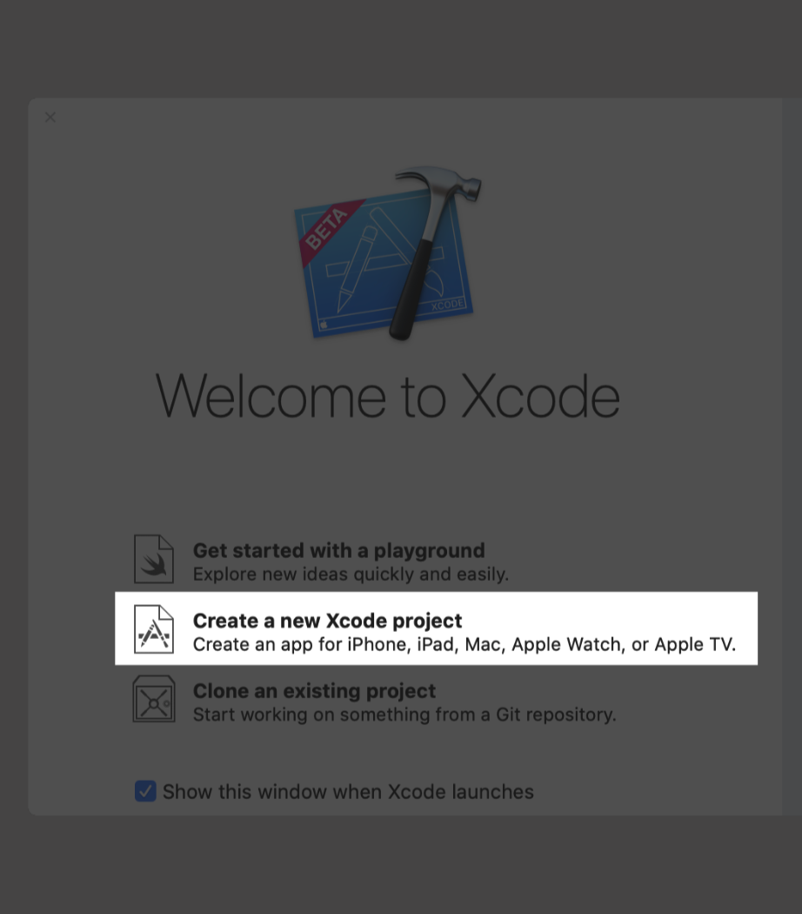
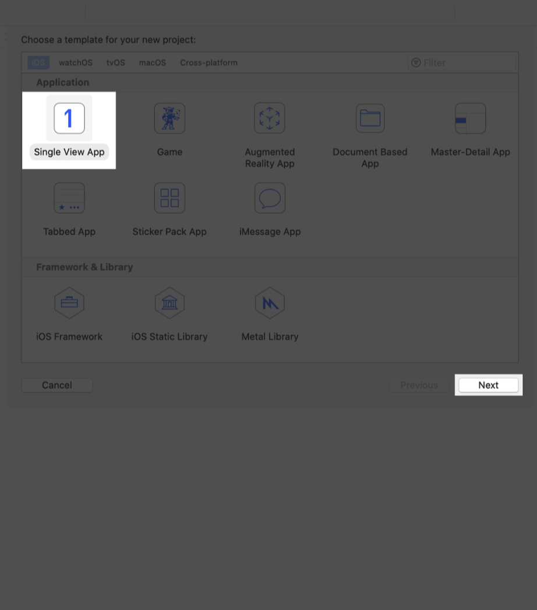
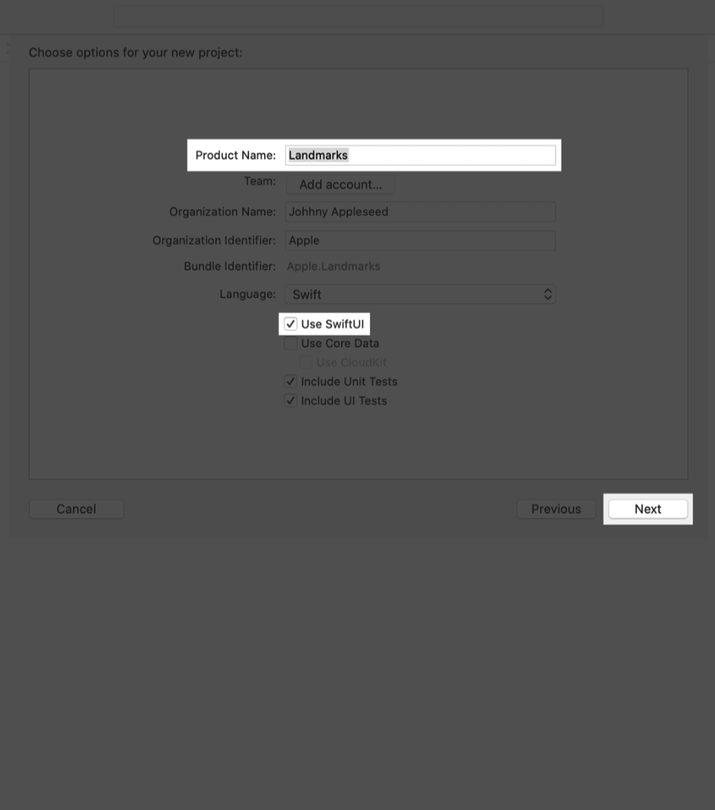

# 1.1 创建一个新项目并探索画布

### 创建一个新项目并探索画布（Canvas）


用 `SwiftUI` 创建一个新的 Xcode 项目。并且浏览一下这个画布（canvas）以及 SwiftUI 模板代码。  
要在 Xcode 中预览画布上的视图并与之交互，请确保 Mac 运行的是 MacOS 10.15 测试版。

#### 第 1 步: 

打开 Xcode，在 Xcode 的启动窗口，点击 `Create a new Xcode project`，或者选择 `Files` -&gt; `New` -&gt; `Project`.



#### 第 2 步:

在模板选择器中，选择 `iOS` 作为平台，选择 `Single View App` 模板，然后单击 `Next`。



#### 第 3 步:

输入 `Landmarks` 作为 `Product Name` ，勾选 `Use SwiftUI` 复选框，然后单击 `Next` 。选择一个位置保存此项目。



#### 第 4 步：

在 `Project navigator` 中，选中 `ContentView.swift` 。

> `ContentView.swift`

```swift
import SwiftUI

struct ContentView : View {
    var body: some View {
        Text("Hello World")
    }
}

#if DEBUG
struct ContentView_Previews : PreviewProvider {
    static var previews: some View {
        ContentView()
    }
}
#endif
```

默认情况下， `SwiftUI` view 文件声明了两个结构体。第一个结构体遵循 `View` 协议，描述 view 的内容和布局。第二个结构体声明该 view 的预览。


#### 第 5 步: 

在 `canvas` 中，单击 `Resume` 来显示预览。

> Tip: 如果没有`canvas` ，选择 `Editor`-&gt; `Editor and Canvas` 来显示。


#### 第 6 步:

在 `body` 属性中，将 `Hello World` 更改为自己的问候语。更改代码时，预览便会实时更新。


