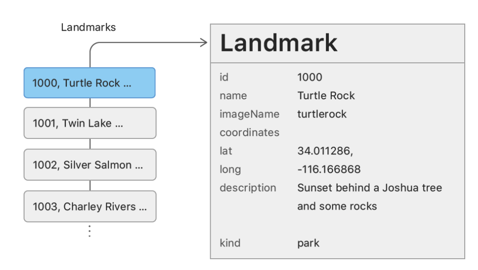
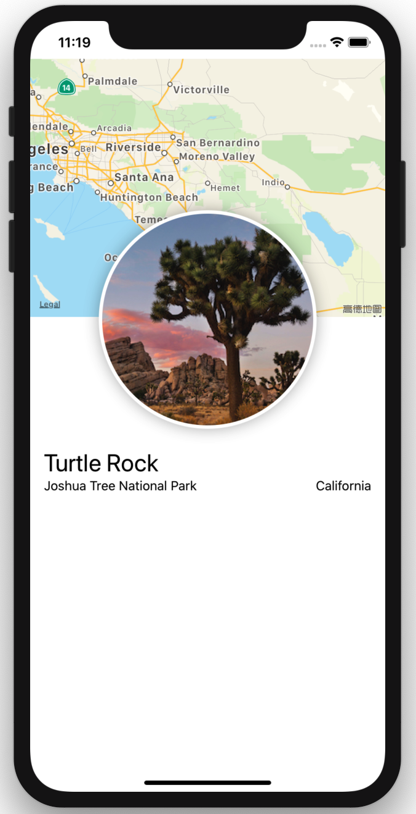

# 1.1 - 了解样本数据

在 [上一个教程](https://app.gitbook.com/@hello-devin/s/ios-notes/~/edit/drafts/-LiOROo-hBa_rHpwKqAi/swiftui-tutorial/swiftui-essentials/1.-chuang-jian-he-zu-he-shi-tu) 中，我们把数据硬编码到了所有自定义 view 中。在本文中，我们来学习如何将数据传递到自定义 view 中并显示。

下载初始项目并熟悉一下样本数据。



#### 第 1 步:

 在 `Project navigator` 中，选择 `Models` &gt; `Landmark.swift` 。

`Landmark.swift` 声明了一个 `Landmark` 结构体，用来存储 app 需要显示的所有地标数据，并从 `landmarkData.json` 导入一组地标数据。

> Landmark.swift

```swift
/*
Abstract:
The model for an individual landmark.
*/

import SwiftUI
import CoreLocation

struct Landmark: Hashable, Codable {
    var id: Int
    var name: String
    fileprivate var imageName: String
    fileprivate var coordinates: Coordinates
    var state: String
    var park: String
    var category: Category

    var locationCoordinate: CLLocationCoordinate2D {
        CLLocationCoordinate2D(
            latitude: coordinates.latitude,
            longitude: coordinates.longitude)
    }

    func image(forSize size: Int) -> Image {
        ImageStore.shared.image(name: imageName, size: size)
    }

    enum Category: String, CaseIterable, Codable, Hashable {
        case featured = "Featured"
        case lakes = "Lakes"
        case rivers = "Rivers"
    }
}

struct Coordinates: Hashable, Codable {
    var latitude: Double
    var longitude: Double
}

```

> Data.swift

```swift
/*
Abstract:
Helpers for loading images and data.
*/

import UIKit
import SwiftUI
import CoreLocation

let landmarkData: [Landmark] = load("landmarkData.json")

func load<T: Decodable>(_ filename: String, as type: T.Type = T.self) -> T {
    let data: Data
    
    guard let file = Bundle.main.url(forResource: filename, withExtension: nil)
        else {
            fatalError("Couldn't find \(filename) in main bundle.")
    }
    
    do {
        data = try Data(contentsOf: file)
    } catch {
        fatalError("Couldn't load \(filename) from main bundle:\n\(error)")
    }
    
    do {
        let decoder = JSONDecoder()
        return try decoder.decode(T.self, from: data)
    } catch {
        fatalError("Couldn't parse \(filename) as \(T.self):\n\(error)")
    }
}

final class ImageStore {
    fileprivate typealias _ImageDictionary = [String: [Int: CGImage]]
    fileprivate var images: _ImageDictionary = [:]
    
    fileprivate static var originalSize = 250
    fileprivate static var scale = 2
    
    static var shared = ImageStore()
    
    func image(name: String, size: Int) -> Image {
        let index = _guaranteeInitialImage(name: name)
        
        let sizedImage = images.values[index][size]
            ?? _sizeImage(images.values[index][ImageStore.originalSize]!, to: size * ImageStore.scale)
        images.values[index][size] = sizedImage
        
        return Image(sizedImage, scale: Length(ImageStore.scale), label: Text(verbatim: name))
    }
    
    fileprivate func _guaranteeInitialImage(name: String) -> _ImageDictionary.Index {
        if let index = images.index(forKey: name) { return index }
        
        guard
            let url = Bundle.main.url(forResource: name, withExtension: "jpg"),
            let imageSource = CGImageSourceCreateWithURL(url as NSURL, nil),
            let image = CGImageSourceCreateImageAtIndex(imageSource, 0, nil)
            else {
                fatalError("Couldn't load image \(name).jpg from main bundle.")
        }
        
        images[name] = [ImageStore.originalSize: image]
        return images.index(forKey: name)!
    }
    
    fileprivate func _sizeImage(_ image: CGImage, to size: Int) -> CGImage {
        guard
            let colorSpace = image.colorSpace,
            let context = CGContext(
                data: nil,
                width: size, height: size,
                bitsPerComponent: image.bitsPerComponent,
                bytesPerRow: image.bytesPerRow,
                space: colorSpace,
                bitmapInfo: image.bitmapInfo.rawValue)
            else {
                fatalError("Couldn't create graphics context.")
        }
        context.interpolationQuality = .high
        context.draw(image, in: CGRect(x: 0, y: 0, width: size, height: size))
        
        if let sizedImage = context.makeImage() {
            return sizedImage
        } else {
            fatalError("Couldn't resize image.")
        }
    }
}
```

#### 第 2 步:

在 `Project navigator` 中，选择 `Resources` &gt; `landmarkData.json`

我们会在本教程的剩余部分以及随后的所有内容中使用此样本数据。

> landmarkData.json

```text
[
    {
        "name": "Turtle Rock",
        "category": "Featured",
        "city": "Twentynine Palms",
        "state": "California",
        "id": 1001,
        "park": "Joshua Tree National Park",
        "coordinates": {
            "longitude": -116.166868,
            "latitude": 34.011286
        },
        "imageName": "turtlerock"
    },
    {
        "name": "Silver Salmon Creek",
        "category": "Lakes",
        "city": "Port Alsworth",
        "state": "Alaska",
        "id": 4,
        "park": "Lake Clark National Park and Preserve",
        "coordinates": {
            "longitude": -152.665167,
            "latitude": 59.980167
        },
        "imageName": "silversalmoncreek"
    },
    {
        "name": "Chilkoot Trail",
        "category": "Rivers",
        "city": "Skagway",
        "state": "Alaska",
        "id": 5,
        "park": "Klondike Gold Rush National Historical Park",
        "coordinates": {
            "longitude": -135.334571,
            "latitude": 59.560551
        },
        "imageName": "chilkoottrail"
    },
    {
        "name": "St. Mary Lake",
        "category": "Lakes",
        "city": "Browning",
        "state": "Montana",
        "id": 8,
        "park": "Glacier National Park",
        "coordinates": {
            "longitude": -113.536248,
            "latitude": 48.69423
        },
        "imageName": "stmarylake"
    },
    {
        "name": "Twin Lake",
        "category": "Lakes",
        "city": "Twin Lakes",
        "state": "Alaska",
        "id": 11,
        "park": "Lake Clark National Park and Preserve",
        "coordinates": {
            "longitude": -153.849883,
            "latitude": 60.641684
        },
        "imageName": "twinlake"
    },
    {
        "name": "Lake McDonald",
        "category": "Lakes",
        "city": "West Glacier",
        "state": "Montana",
        "id": 6,
        "park": "Glacier National Park",
        "coordinates": {
            "longitude": -113.934831,
            "latitude": 48.56002
        },
        "imageName": "lakemcdonald"
    },
    {
        "name": "Charley Rivers",
        "category": "Rivers",
        "city": "Eaking",
        "state": "Alaska",
        "id": 1,
        "park": "Charley Rivers National Preserve",
        "coordinates": {
            "longitude": -143.122586,
            "latitude": 65.350021
        },
        "imageName": "yukon_charleyrivers"
    },
    {
        "name": "Icy Bay",
        "category": "Lakes",
        "city": "Icy Bay",
        "state": "Alaska",
        "id": 2,
        "park": "Wrangell-St. Elias National Park and Preserve",
        "coordinates": {
            "longitude": -141.518167,
            "latitude": 60.089917
        },
        "imageName": "icybay"
    },
    {
        "name": "Rainbow Lake",
        "category": "Lakes",
        "city": "Willow",
        "state": "Alaska",
        "id": 3,
        "park": "State Recreation Area",
        "coordinates": {
            "longitude": -150.086103,
            "latitude": 61.694334
        },
        "imageName": "rainbowlake"
    },
    {
        "name": "Hidden Lake",
        "category": "Lakes",
        "city": "Newhalem",
        "state": "Washington",
        "id": 7,
        "park": "North Cascades National Park",
        "coordinates": {
            "longitude": -121.17799,
            "latitude": 48.495442
        },
        "imageName": "hiddenlake"
    },
    {
        "name": "Chincoteague",
        "category": "Rivers",
        "city": "Chincoteague",
        "state": "Virginia",
        "id": 9,
        "park": "Chincoteague National Wildlife Refuge",
        "coordinates": {
            "longitude": -75.383212,
            "latitude": 37.91531
        },
        "imageName": "chincoteague"
    },
    {
        "name": "Lake Umbagog",
        "category": "Lakes",
        "city": "Errol",
        "state": "New Hampshire",
        "id": 10,
        "park": "Umbagog National Wildlife Refuge",
        "coordinates": {
            "longitude": -71.056816,
            "latitude": 44.747408
        },
        "imageName": "umbagog"
    }
]
```

#### 第 3 步: 

需要注意的是，在 [上一个教程 ](https://app.gitbook.com/@hello-devin/s/ios-notes/~/edit/drafts/-LiTXjjfbpQfiRNKNok0/swiftui-tutorial/swiftui-essentials/1.-chuang-jian-he-zu-he-shi-tu)中的 `ContentView` 类型现在更名为 `LandmarkDetail` 。

接下来我们还会创建多个 view 类型。

> LandmarkDetail.swift

```swift
import SwiftUI
import MapKit

struct LandmarkDetail : View {
    var body: some View {
        VStack {
            MapView()
                .frame(height: 300)
            
            CircleImage()
                .offset(y: -130)
                .padding(.bottom, -130)
            
            VStack(alignment: .leading) {
                Text("Turtle Rock")
                    .font(.title)
                HStack(alignment: .top) {
                    Text("Joshua Tree National Park")
                        .font(.subheadline)
                    Spacer()
                    Text("California")
                        .font(.subheadline)
                }
                }
                .padding()
            
            Spacer()
        }
    }
}
```




