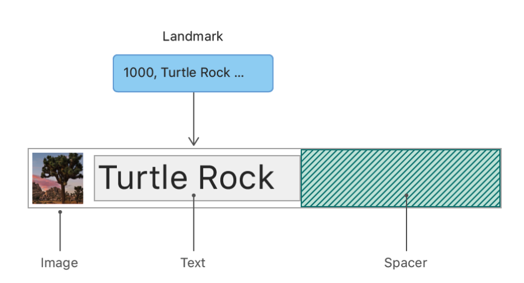
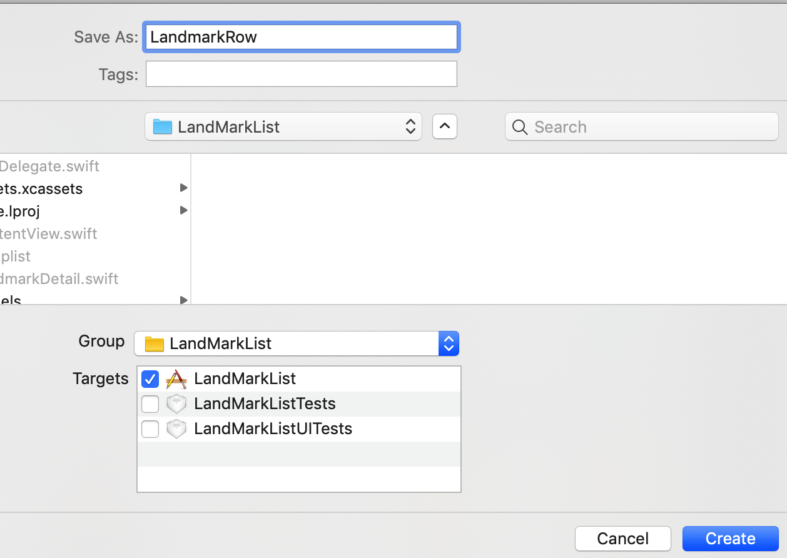
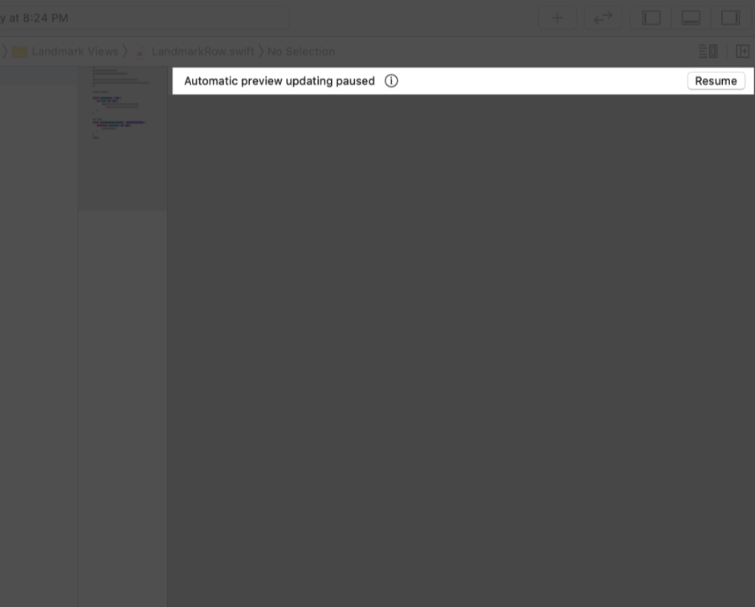
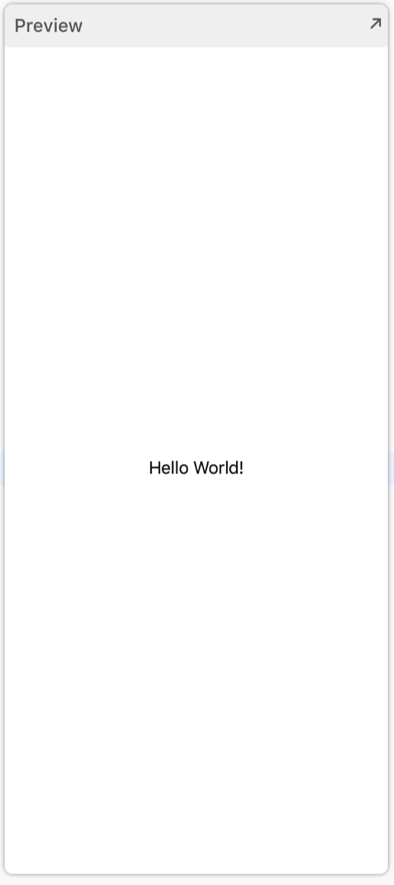
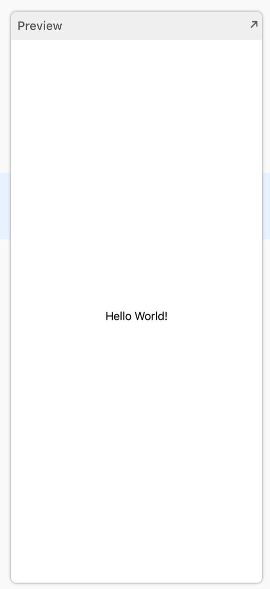
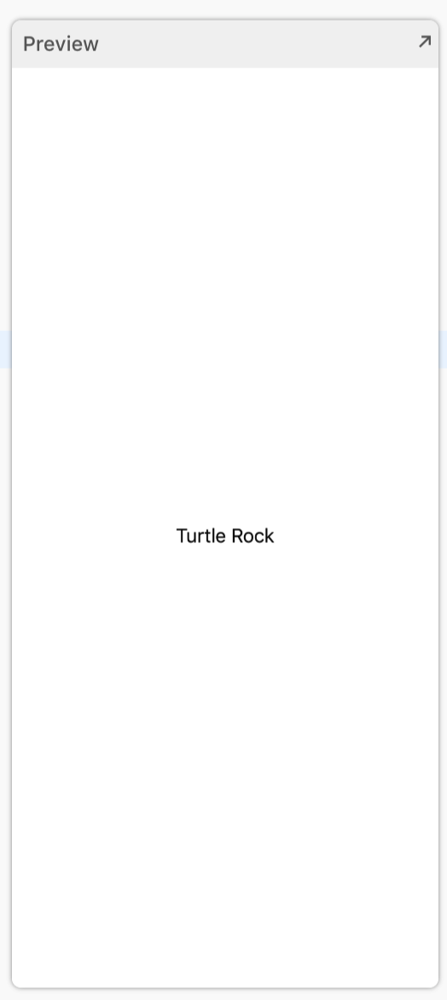
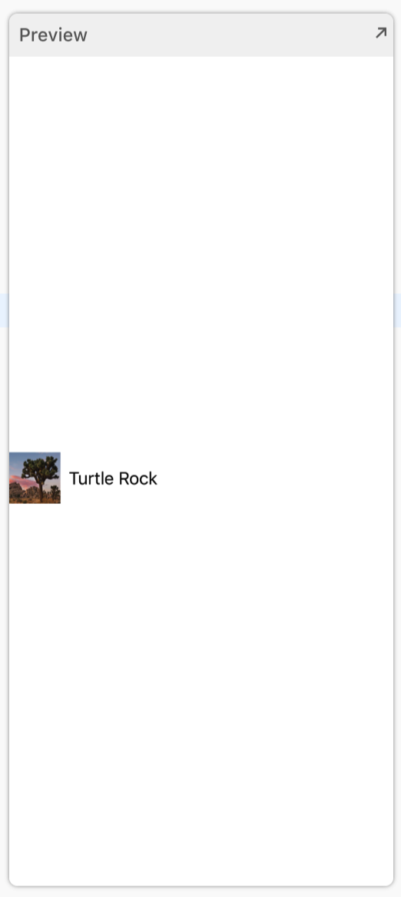

# 1.2 - 创建 Row View

我们在本文中构建的第一个 view 是用于显示每个地标详情的 `row` 。 `row` 将地标数据存储在 `landmark` 属性中，这样一个 `row` 就可以显示任何地标。稍后我们会把多个 `row` 组合成一个地标列表。



#### 第 1 步:

创建一个新的 `SwiftUI` view，命名为 `LandmarkRow.swift` 。



#### 第 2 步:

如果预览没有显示，请选择 `Editor` &gt; `Editor and Canvas` , 然后单击 `Get Started` 。



#### 第 3 步:

 `LandmarkRow` 添加一个存储属性 `landmark` 。  
当你添加 `landmark` 属性时，预览会停止工作，因为 `LandmarkRow` 类型在初始化时需要一个 `landmark` 实例。

> LandmarkRow.swift

```swift
import SwiftUI

struct LandmarkRow : View {
    
    var landmark: Landmark
    
    var body: some View {
        Text(/*@START_MENU_TOKEN@*/"Hello World!"/*@END_MENU_TOKEN@*/)
    }
}

#if DEBUG
struct LandmarkRow_Previews : PreviewProvider {
    static var previews: some View {
        LandmarkRow()
    }
}
#endif
```

为了恢复预览，我们需要修改 `PreviewProvider` 。

#### 第 4 步:

在 `LandmarkRow_Previews` 的静态属性 `previews` 中，给 `LandmarkRow` 的初始化方法添加 `landmark` 参数，并将 `landmarkData` 数组的第一个元素赋值给 `landmark` 参数。

这时预览就会显示 `Hello World` 的文字。

> LandmarkRow.swift

```swift
import SwiftUI

struct LandmarkRow : View {
    
    var landmark: Landmark
    
    var body: some View {
        Text(/*@START_MENU_TOKEN@*/"Hello World!"/*@END_MENU_TOKEN@*/)
    }
}

#if DEBUG
struct LandmarkRow_Previews : PreviewProvider {
    static var previews: some View {
        LandmarkRow(landmark: landmarkData[0])
    }
}
#endif
```



恢复预览后，我们就可以构建 `row` 的布局了。

#### 第 5 步:

把现有的 text view 嵌套到一个 `HStack` 中。

> LandmarkRow.swift

```swift
import SwiftUI

struct LandmarkRow : View {
    
    var landmark: Landmark
    
    var body: some View {
        HStack {
           Text(/*@START_MENU_TOKEN@*/"Hello World!"/*@END_MENU_TOKEN@*/)
        }
    }
}

#if DEBUG
struct LandmarkRow_Previews : PreviewProvider {
    static var previews: some View {
        LandmarkRow(landmark: landmarkData[0])
    }
}
#endif
```



#### 第 6 步:

将 text view 的内容修改成 `landmark.name` 。

> LandmarkRow.swift

```swift
import SwiftUI

struct LandmarkRow : View {
    
    var landmark: Landmark
    
    var body: some View {
        HStack {
           Text(Landmark.name)
        }
    }
}

#if DEBUG
struct LandmarkRow_Previews : PreviewProvider {
    static var previews: some View {
        LandmarkRow(landmark: landmarkData[0])
    }
}
#endif
```



#### 第 7 步：

在 text view 前添加一个图片来完成 `row` 。

> LandmarkRow.swift

```swift
import SwiftUI

struct LandmarkRow : View {
    
    var landmark: Landmark
    
    var body: some View {
        HStack {
            landmark.image(forSize: 50)
            Text(landmark.name)
        }
    }
}

#if DEBUG
struct LandmarkRow_Previews : PreviewProvider {
    static var previews: some View {
        LandmarkRow(landmark: landmarkData[0])
    }
}
#endif
```




