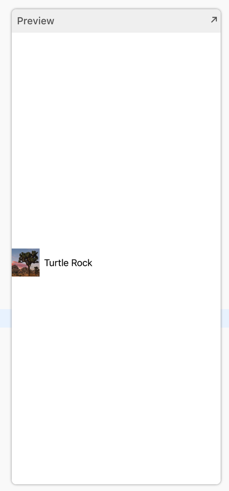

# 2.3 - 自定义 Row 的预览

Xcode的 `canvas` 会自动识别并显示当前编辑器中符合 `PreviewProvider` 协议的任何类型。 `preview provider` 返回一个或多个 view ，其中包含了用来配置大小和设备的选项。

通过自定义 `preview provider` 的返回值，我们可以让预览来显示需要的内容。


#### 第 1 步:

在 `LandmarkRow_Previews` 中，把 `landmark` 的参数改成 `landmarkData` 数组的第二个元素。  
预览会立即从第一个元素切换到第二个元素的显示。

> LandmarkRow.swift

```swift
import SwiftUI

struct LandmarkRow : View {
    
    var landmark: Landmark
    
    var body: some View {
        HStack {
            landmark.image(forSize: 50)
            Text(landmark.name)
        }
    }
}

#if DEBUG
struct LandmarkRow_Previews : PreviewProvider {
    static var previews: some View {
        LandmarkRow(landmark: landmarkData[1])
    }
}
#endif
```



#### 第 2 步:

用 `previewLayout(_:)` 方法设置 `row` 在列表中的大概大小。

> LandmarkRow.swift

```swift
import SwiftUI

struct LandmarkRow : View {
    
    var landmark: Landmark
    
    var body: some View {
        HStack {
            landmark.image(forSize: 50)
            Text(landmark.name)
        }
    }
}

#if DEBUG
struct LandmarkRow_Previews : PreviewProvider {
    static var previews: some View {
        LandmarkRow(landmark: landmarkData[1])
            .previewLayout(.fixed(width: 300, height: 70))
    }
}
#endif
```


我们可以在 `preview provider` 中使用 `Group` 来返回多个预览。

#### 第 3 步:

把返回的 `row` 包装到一个 `Group` 中，并且把第一个 `row` 添加回来。

> LandmarkRow.swift

```swift
import SwiftUI

struct LandmarkRow : View {
    
    var landmark: Landmark
    
    var body: some View {
        HStack {
            landmark.image(forSize: 50)
            Text(landmark.name)
        }
    }
}

#if DEBUG
struct LandmarkRow_Previews : PreviewProvider {
    static var previews: some View {
        Group {
            LandmarkRow(landmark: landmarkData[0])
                .previewLayout(.fixed(width: 300, height: 70))
            LandmarkRow(landmark: landmarkData[1])
                .previewLayout(.fixed(width: 300, height: 70))
        }
        
    }
}
#endif
```


把 `previewLayout(_:)` 的调用移到 `group` 声明的外面来精简代码。

一个 view 的子项会继承 view 的上下文设置，比如这里的预览设置。

> LandmarkRow.swift

```swift
import SwiftUI

struct LandmarkRow : View {
    
    var landmark: Landmark
    
    var body: some View {
        HStack {
            landmark.image(forSize: 50)
            Text(landmark.name)
        }
    }
}

#if DEBUG
struct LandmarkRow_Previews : PreviewProvider {
    static var previews: some View {
        Group {
            LandmarkRow(landmark: landmarkData[0])
            LandmarkRow(landmark: landmarkData[1])
        }
        .previewLayout(.fixed(width: 300, height: 70))
    }
}
#endif
```


在 `preview provider` 中编写的代码只会改变 Xcode 在 `canvas` 中的显示。由于 `#if DEBUG` 指令的存在，当 app 发布时，编译器会删除这些代码。


