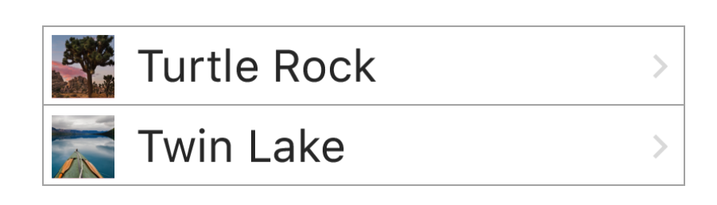

# 1.4 创建地标列表

使用 `SwiftUI` 的 `List` 类型可以显示平台特有的列表 view 。列表的元素可以是静态的，就像我们创建的 `stacks` 的子 view 一样；也可以是动态生成的。甚至可以把静态和动态生成的 view 混合在一起。



#### 第 1 步:

创建一个新的 `SwiftUI` view，命名为 `LandmarkList.swift` 。


#### 第 2 步:

把默认的 `Text` view 换成 `List` ，然后传入两个包含头两个地标数据的 `LandmarkRow` 对象，作为 `List` 的子项。

预览会以适合 iOS 样式的列表来显示这两个地标。

> LandmarkList.swift

```swift
import SwiftUI

struct LandmarkList : View {
    var body: some View {
        List {
            LandmarkRow(landmark: landmarkData[0])
            LandmarkRow(landmark: landmarkData[1])
        }
    }
}

#if DEBUG
struct LandmarkList_Previews : PreviewProvider {
    static var previews: some View {
        LandmarkList()
    }
}
#endif
```


