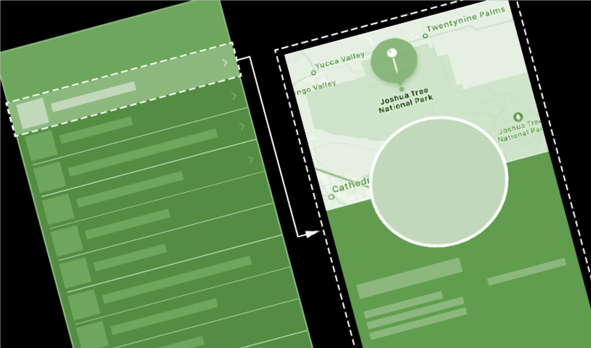

# 2. 构建列表和导航

> 完成了基础的地标详情 view 后，我们需要为用户提供查看完整地标列表，以及查看每个地标详情的方法。  
>   
> 在本文中，我们将会创建可显示任何地标信息的 view ，并动态生成滚动列表，用户可以点按该列表以查看地标的详细视图。另外，我们还将使用 Xcode 的 `canvas` 来显示不同设备的大小，以此来微调 UI。  
>   
> 下载项目文件并按照以下步骤操作。  
>  👉 预计完成时间：35 分钟  
>  👉 初始项目文件: [下载](https://docs-assets.developer.apple.com/published/ccd7eeefd0/BuildingListsAndNavigation.zip)

