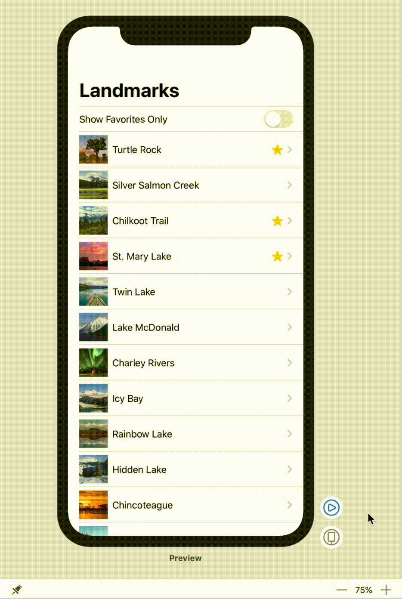

# 3.3 - 添加控件来切换状态

为了让用户控制列表的过滤，我们需要一个可以修改 `showFavoritesOnly` 值的控件。通过给切换控件传递一个 `binding` 来实现这个需求。

`binding` 是对可变状态的引用。当用户将状态从关闭切换为打开然后再关闭时，控件使用 `binding`来更新 view 相应的状态


#### 第 1 步:

创建一个嵌套的 `ForEach group` 将 `landmarks` 转换为 `rows` 。

若要在列表中组合静态和动态 view ，或者将两个或多个不同的动态 view 组合在一起，要使用 `ForEach` 类型，而不是将数据集合传递给 `List` 。

> LandmarkList.swift

```swift
import SwiftUI

struct LandmarkList: View {
    
    @State var showFavoritesOnly = false
    
    var body: some View {
        NavigationView {
            ForEach(landmarkData) { landmark in
                List {
                    if !self.showFavoritesOnly || landmark.isFavorite {
                        NavigationButton(destination: LandmarkDetail(landmark: landmark)) {
                            LandmarkRow(landmark: landmark)
                        }
                    }
                }
            }
            .navigationBarTitle(Text("Landmarks"), displayMode: .large)
        }
    }
}

#if DEBUG
struct LandmarkList_Previews: PreviewProvider {
    static var previews: some View {
        ForEach(["iPhone SE", "iPhone XS Max"].identified(by: \.self)) { deviceName in
            LandmarkList()
                .previewDevice(PreviewDevice(rawValue: deviceName))
                .previewDisplayName(deviceName)
        }
    }
}
#endif
```


#### 第 2 步:

添加一个 `Toggle` view 作为 `List` view 的第一个子项，然后给 `showFavoritesOnly` 传递一个 `binding`。

我们使用 `$` 前缀来访问一个状态变量或者它的属性的 `binding` 。

> LandmarkList.swift

```swift
import SwiftUI

struct LandmarkList: View {
    
    @State var showFavoritesOnly = true
    
    var body: some View {
        NavigationView {
            List {
                Toggle(isOn: $showFavoritesOnly) {
                    Text("Favorites only")
                }
                ForEach(landmarkData) { landmark in
                    if !self.showFavoritesOnly || landmark.isFavorite {
                        NavigationButton(destination: LandmarkDetail(landmark: landmark)) {
                            LandmarkRow(landmark: landmark)
                        }
                    }
                }
            }
            .navigationBarTitle(Text("Landmarks"), displayMode: .large)
        }
    }
}

#if DEBUG
struct LandmarkList_Previews: PreviewProvider {
    static var previews: some View {
        ForEach(["iPhone SE", "iPhone XS Max"].identified(by: \.self)) { deviceName in
            LandmarkList()
                .previewDevice(PreviewDevice(rawValue: deviceName))
                .previewDisplayName(deviceName)
        }
    }
}
#endif
```


#### 第 3 步:

使用实时预览并点击切换来尝试这个新功能。




